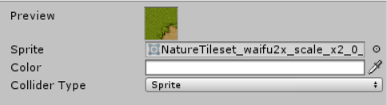

Tile Map
===========

일정한 크기와 모양을 가진 그림 조각을 의미합니다. 게임에서는 이 조각(Tile)들을 조합하여 게임 배경을 제작할 수 있습니다. 
이렇게 완성된 게임 배경을 Tilemap 이라고 부릅니다.
Unity Engine에서는 2017.2 부터 지원을 합니다. 기존에는 Asset Store로 Tool을 구매하거나 Window Programming으로 직접 제작하거나, 
Unity Editor를 통해 지금과 같은 Tilemap Tool을 제작하여 사용해왔습니다. 
Unity Live Session을 통해 Unity에 추가된 Tilemap은 어떤 기능이 있고 활용할 수 있는지 알아보려고 합니다.

# 1. Tilemap 생성

Hierarchy에서 Create 메뉴 또는 우측 마우스로 2D 카테고리에 접근하여 Tilemap을 생성할 수 있습니다.
누르면 'Grid' Object가 추가되고 자식 Object에는 'Tilemap'과 'Tile Renderer'가 추가되어있습니다.

### Grid

실제 Scene View에서 Tile을 배치할 격자 무늬를 나타냅니다. Tile Palette를 통해 그려진 Tile map은 해당 Grid의 자식 Object로 생성됩니다.
(UI Canvas와 유사함)

* cell size : 격자의 cell 크기를 조절
* cell gap : 격자의 각 cell마다 간격 조절
* cell swizzle : 'Swizzle'이라는 뜻이 생소하여 여기저기 찾아보았습니다. 알고보니 간편하게 보이기 위한 표기법이었습니다.
보통 HLSL 코드에서 많이 볼 수가 있었으며 이를 'Swizzling'이라고 부르는데, 벡터의 성분들을 임의의 순서로 정해 표기하는 기법을 의미합니다.
예를들어 A벡터와 B벡터가 존재하고

A.x = B.y

A.y = B.z

A.z = B.x

라고 한다면 A = B.yzx 라고 간결하게 표현할 수 있습니다.

#### cell swizzle을 XYZ로 변환

#### cell swizzle을 XZY로 변환

이를 통해 cell swizzle이라는 것은 격자를 원하는 좌표계로 설정하는 것을 의미합니다.

이것이 왜 필요하고 어떻게 응용할 수 있을지 고민해보았는데, 시점을 변환하여 퍼즐을 푸는 PC 게임 'FEZ'와 같은 게임의 배경을 제작한다거나...
Quarter View 게임을 제작할 때 사용할 것 같습니다.

### TileMap
그려진 Tile Sprite를 모아놓은 Object에 붙여진 Component 입니다. Grid의 자식 Object로 생성됩니다. Photoshop의 Layer 방식과 유사합니다.

* Animation Frame Rate : Tile Palette에 저장된 Tile Animation의 Frame 속도를 조절
* Color : Tile Palette에 저장된 Tile들의 색깔을 조정
* Tile Anchor : 해당 Tile Palette로 그려진 Tile의 기준점을 조정
* Orientation : Tile의 좌표계 설정. 해당 Grid의 Cell Swizzle와 동일하게 맞춰서 사용하는것이 좋다.

### Tile Renderer
정렬, 재질, Mask 기능을 포함된 Tile으 그릴 방법을 제어하는 Component 입니다. Sprite Renderer와 유사합니다.

* Material : Tile Sprite의 재질 설정
* Sorting Layer : Render시 Sprite의 전후 관계를 정의하는 layer
* Order In Layer : 동일한 Sorting Layer에서의 Sprite Overlay 우선순위. 작은 번호가 먼저 그려지고 큰 번호가 뒤에서 그려진다.
* Mask Interaction : Tile Sprite를 숨기거나 보여주는 기능. 일반적인 Mask 기능이다. 사용 시, Sprite Mask Component를 가진 Object와 사용한다.

#### Mask None

#### Visible Inside Mask

#### Visible Outside Mask

### Tile Palette

Asset 형식으로 된 Tile Sprite를 모아놓은 구성 요소입니다. Tile Palette View에서 Create Palette로 생성된 Palette를 나타냅니다.

1. Scene View에서 Tile을 선택
2. Scene View에서 선택된 Tile을 이동
3. Tile Palette에 선택된 Tile을 Scene View에서 그림
4. Tile Palette에 선택된 Tile을 Rect형태로 그림
5. Scene View에 그려진 Tile 선택 시, 해당 Tile을 활성화함(일반적인 스포이드 기능)
6. Scene View에서 선택한 Tile 지움
7. Scene View에서 Tile 채우기
8. 생성된 Tile Palette 목록
9. 현재 Tile Palette의 이름
10. Tile Palette의 Tile들을 편집. 1~7번까지의 기능들을 Tile Palette에서 사용가능
11. Tile Palette에 저장된 Tile들
12. 현재 사용중인 Brush. GridBrushBase를 상속받아 Custom Brush를 제작한 경우, 해당 목록에 추가되어 사용함

### Tile

Tilemap을 그릴 Sprite입니다. 색깔을 변경할 수 있으며 Collider Type도 지정이 가능합니다.

* Preview : Tile Sprite 표시
* Sprite : Project에 저장된 Sprite
* Color : Sprite 색깔 조정
* Collider Type : 충돌체 크기 설정. None과 Sprite, Grid가 있으며 자세한건 추후에 추가 예정

# 2. Tilemap Scripting
Tilemap은 사용자가 편집하여 사용할 수 있습니다. Tilemap에 그려진 Tile의 동작이나 Tilemap에 그릴 때 동작 등을 바꿀 수 있습니다.

### TileBase
TileBase를 상속받아 Tilemap 기능을 편집할 수 있습니다. 대표적을 4개의 함수를 Override 하여 사용합니다.

* RefreshTile : Tile이 Tilemap에 추가될 때 주위의 어떤 타일이 Update 될지 결정
* GetTileData : Tilemap에 표시되는 타Tile의 모습을 결정
* GetTileAnimationData : Tile의 Animation 여부 확인
* StartUp : Tilemap이 Update 되면 각 Tile에 대한 동작을 정의함

### GridBrushBase
GridBrushBase를 상속받아 TilePalette의 Brush 기능을 편집할 수 있습니다. 대표적을 5가지의 함수를 Override 하여 사용합니다.

* Paint : Brush로 target grid에 항목을 추가할 수 있다. 기본적으로 왼쪽 클릭으로 칠함
* Erase : Brush로 target grid에 항목을 제거할 수 있다. 기본적으로 Shift + 왼쪽 클릭으로 지움
* FloodFill : Brush로 target grid에서 항목을 채울 수 있다. 기본적으로 Drag로 채움
* Rotate : Brush에 설정된 항목을 회전할 수 있다. 기본적으로 [] 로 회전 가능
* Flip : Brush에 설정된 항목을 뒤집을 수 있다. Shift + [] 로 뒤집기

위의 Tilemap 편집 기능들은 추후에 사용해보면서 익힐 예정입니다.
